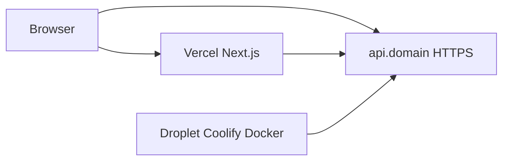

# Hybrid hosting runbook (Vercel + DigitalOcean + Coolify)

This document is the **single playbook** for how this project runs in production: frontend on Vercel, API on a VPS managed by Coolify, DNS on Vercel, TLS everywhere. Use it to reproduce the setup on a new project or hand it to an AI with full context.

**Related (app code, not infra):** see `docs/ELITE_ARCHITECTURE.md` for product architecture.

---

## 1. What we built (mental model)

| Piece | Role |
|--------|------|
| **DigitalOcean Droplet** | Linux server (Ubuntu) with a public IP. You pay for this. |
| **Coolify** | Self-hosted UI installed **on that same Droplet**. It runs Docker, builds images, assigns domains, and renews HTTPS. It is **not** a separate cloud—think “control panel on your VPS.” |
| **“localhost” in Coolify** | Means “this machine”—i.e. the Droplet where Coolify is installed. It does **not** mean your laptop. |
| **Vercel** | Hosts the Next.js **frontend** only. |
| **`api.<domain>`** | Points at the Droplet (A record). The API is **not** served by Vercel. |
| **Repo layout** | `apps/api/` = Express API + Dockerfile. Root Next app = UI; client `fetch` calls go to `NEXT_PUBLIC_API_BASE_URL`. |



---

## 2. Environment snapshot (this project)

Update when you clone this pattern elsewhere.

| Item | Value (example) |
|------|-------------------|
| VPS provider | DigitalOcean |
| OS | Ubuntu 24.04 LTS |
| Region | e.g. SFO3 |
| Droplet size | ~2 vCPU / 4 GB (Basic shared) |
| Public IPv4 | e.g. `147.182.244.148` |
| Frontend domain | `immigrationdoc.app` (Vercel) |
| API subdomain | `api.immigrationdoc.app` → A record → Droplet IP |
| Coolify UI | `http://<DROPLET_IP>:8000` (until you put it behind a hostname) |
| API container port | `3001` (see `apps/api` and Dockerfile) |
| Health check | `GET https://api.<domain>/health` → `{"status":"ok",...}` |

---

## 3. Provisioning the Droplet (DigitalOcean)

1. Create a **Droplet**: Ubuntu 24.04 LTS, Basic plan, add your **SSH public key** (`~/.ssh/id_ed25519.pub`) at create time.
2. Note the **public IPv4**.

---

## 4. DNS (Vercel)

For domain managed in Vercel → **Domains** → **DNS Records**:

- **A** record: **Name** `api` (not the full hostname), **Value** = Droplet IPv4.
- Do **not** attach `api.*` as a Vercel *project* domain for the Next app—the API is not on Vercel.

Optional: `dig +short api.<yourdomain>` should return the Droplet IP after propagation.

---

## 5. First boot on the server (SSH as root)

```bash
ssh root@<DROPLET_IP>
```

```bash
apt update && apt upgrade -y
```

**Firewall (UFW)** — allow SSH, HTTP, HTTPS, and Coolify UI port:

```bash
ufw allow OpenSSH
ufw allow 80/tcp
ufw allow 443/tcp
ufw allow 8000/tcp
ufw enable
```

**DigitalOcean Cloud Firewall (if used):** inbound TCP **22, 80, 443, 8000** must match; otherwise traffic never reaches the Droplet.

---

## 6. Install Coolify

As root:

```bash
curl -fsSL https://cdn.coollabs.io/coolify/install.sh | bash
```

- Open `http://<DROPLET_IP>:8000`, create admin account.
- Onboarding: **Server type** → **This Machine** (Coolify + workloads on same Droplet).

**If proxy shows “Exited”:** start the proxy from the server screen in Coolify (needed for HTTPS routing).

---

## 7. GitHub ↔ Coolify

**Sources** → add **GitHub App** → **Register Now** → install on GitHub (e.g. all repos or selected).  
Permissions UI may show “N/A” until refetched—that does not always block deploys if the app install succeeded.

---

## 8. Prove HTTPS before the real API (optional test app)

1. New **Project** → add **Application** → **Docker Image** → e.g. `nginxdemos/hello`, port **80**.
2. **Domains:** `https://api.<yourdomain>` → HTTPS / Let’s Encrypt → **Deploy**.
3. Browser: `https://api.<yourdomain>` should load with a valid certificate.

Remove or stop this test app before attaching the same domain to the real API (only one resource should own `api.*`).

---

## 9. Real API: `apps/api` on Coolify

1. **+ Application** → GitHub → repo + branch `main`.
2. **Build pack:** Dockerfile.
3. **Base directory:** `apps/api` (leading slash in UI may show as `/apps/api`—same idea).
4. **Dockerfile:** `Dockerfile` under that context.
5. **Port:** `3001` (matches Express `PORT` / Dockerfile `EXPOSE`).
6. **Environment variables** (Coolify → app → Environment Variables), examples:
   - `PORT=3001`
   - `APP_URL=https://<frontend-domain>` (used by Stripe success URLs when enabled)
   - `OPENAI_API_KEY`, `ANTHROPIC_API_KEY` (AI)
   - Later: `STRIPE_*`, `RESEND_API_KEY`, etc.
7. **Domains:** `https://api.<yourdomain>` on this app; remove test app domain first to avoid conflicts.
8. **Deploy.** Verify: `curl https://api.<yourdomain>/health`

---

## 10. Frontend: Vercel env + code

**Vercel** → Project → **Settings** → **Environment Variables**:

- `NEXT_PUBLIC_API_BASE_URL` = `https://api.<yourdomain>` (Production at minimum).

**Local dev:** add the same to `.env.local` (not committed):

```env
NEXT_PUBLIC_API_BASE_URL=https://api.<yourdomain>
```

Redeploy Vercel after changing public env vars (they are baked at build time).

**Frontend fetch:** client code must call the external API, e.g.  
`${process.env.NEXT_PUBLIC_API_BASE_URL}/api/generate`  
—not only `/api/...` relative to Vercel.

**CORS:** Express in `apps/api` should allow the Vercel origin(s) and `http://localhost:3000` for local dev.

---

## 11. Server users and SSH (team)

**Pattern:** one Linux user per person; each uses their **own** SSH key pair. Passphrases are local to each machine. Only **public** keys go on the server (`~/.ssh/authorized_keys`).

**Example (macOS, first admin user):**

```bash
sudo adduser caprise
sudo usermod -aG sudo caprise
sudo mkdir -p /home/caprise/.ssh
sudo cp /root/.ssh/authorized_keys /home/caprise/.ssh/
sudo chown -R caprise:caprise /home/caprise/.ssh
sudo chmod 700 /home/caprise/.ssh
sudo chmod 600 /home/caprise/.ssh/authorized_keys
```

**Windows partner key issues:** if `~/.ssh` has permission errors, generate key to Desktop, e.g.:

```powershell
cd $env:USERPROFILE\Desktop
ssh-keygen -t ed25519 -f ".\immigration_key"
# Enter twice for empty passphrase, or use: ssh-keygen ... --% -N ""
Get-Content .\immigration_key.pub
```

On server (as sudo user):

```bash
sudo adduser jaham
sudo usermod -aG sudo jaham
sudo mkdir -p /home/jaham/.ssh
echo 'ssh-ed25519 AAAA... comment' | sudo tee /home/jaham/.ssh/authorized_keys
sudo chown -R jaham:jaham /home/jaham/.ssh
sudo chmod 700 /home/jaham/.ssh
sudo chmod 600 /home/jaham/.ssh/authorized_keys
```

Partner connects:

```powershell
ssh -i "$env:USERPROFILE\Desktop\immigration_key" jaham@<DROPLET_IP>
```

**Coolify access:** usually one shared admin login unless you configure Teams.

---

## 12. Maintenance

- **Reboot** after kernel upgrades: `sudo reboot` (Docker/Coolify generally come back automatically).
- **Patches:** periodic `apt update && apt upgrade` on the Droplet.
- **Optional hardening:** disable SSH password auth; disable root SSH login once sudo users work; keep only key-based auth.
- **Secrets:** never commit `.env.local` or private keys; store production secrets in Coolify + Vercel + a password manager.

---

## 13. Stripe webhooks (when you enable payments)

Stripe Dashboard → Webhooks → URL:

`https://api.<yourdomain>/api/stripe/webhook`

Set `STRIPE_WEBHOOK_SECRET` (and related Stripe vars) in Coolify. Raw body is required for signature verification (handled in Express).

---

## 14. Common pitfalls

| Symptom | Likely cause |
|---------|----------------|
| `POST undefined/api/...` | `NEXT_PUBLIC_API_BASE_URL` missing in Vercel build or `.env.local`; redeploy / restart dev server. |
| Domain conflict in Coolify | Another app still has `https://api.*`; clear domain on old app. |
| `api.<domain>` shows JSON “Not found” at `/` | Normal—there is no web page; use `/health` or real `/api/...` routes. |
| Coolify shows “localhost” | Expected: means the Droplet Coolify runs on, not your PC. |
| GitHub App webhook | Must complete **Register** flow so Coolify receives deploy hooks. |

---

## 15. Quick verification checklist

- [ ] `curl https://api.<domain>/health` → 200, JSON `status: ok`
- [ ] `https://<frontend-domain>/start` → letter generates (calls external API)
- [ ] Coolify app **Running**, proxy **Running**
- [ ] Partner SSH + Coolify login tested (if applicable)

---

*Last updated to match the production setup described above (Vercel frontend, Coolify/Docker API, DNS, TLS, team SSH).*
