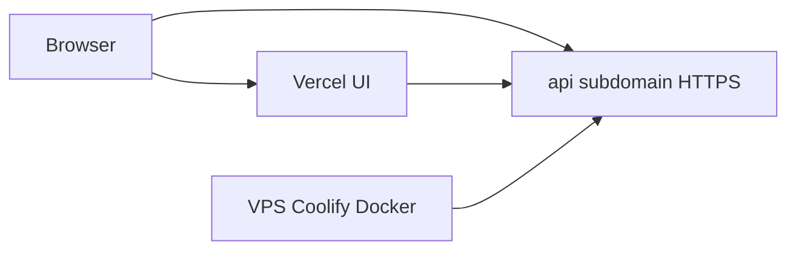

# Hybrid hosting runbook (reusable)

**Pattern:** frontend on **Vercel**, backend API in **Docker** on a **VPS**, managed by **Coolify**. DNS sends `www` / apex to Vercel and `api` (or another subdomain) to the VPS.

This file is **generic**: same steps apply to the next product. Details (domain names, ports, env vars) change; the order does not.

**App-specific code docs** (not hosting): see other files under `docs/` as needed.

---

## How to use this doc

1. Copy the **numbered checklist** when you start a new server or a new app on an existing server.
2. Fill the **deployment record** table with your real values (keep a copy outside git if it has secrets).
3. Skim **Concepts** once so “localhost” in Coolify and similar labels make sense.
4. Use **Team & access** when onboarding a partner (SSH + Coolify).
5. Read **Optional integrations** only if that project needs payments, email, etc.

---

## Concepts (read once)

| Term | Meaning |
|------|--------|
| **Droplet / VPS** | The Linux server you rent (e.g. DigitalOcean). Has a public IPv4. |
| **Coolify** | Software you install **on the VPS**. It builds Docker images, routes domains, HTTPS. Not a separate cloud product. |
| **“localhost” / This Machine in Coolify** | The server Coolify is installed on—your VPS—not your laptop. |
| **Proxy (Caddy)** | Coolify’s reverse proxy; must be **running** for HTTPS and routing. |
| **Frontend** | Usually Next.js on Vercel; users hit `https://yourdomain.com`. |
| **API host** | e.g. `https://api.yourdomain.com` — DNS points to the VPS; **not** Vercel. |

---

## Deployment record (fill in per project)

| Field | Your value |
|-------|------------|
| VPS provider | |
| Droplet region / size | |
| Droplet public IPv4 | |
| OS | e.g. Ubuntu 24.04 LTS |
| Frontend URL | e.g. `https://app.example.com` |
| API URL | e.g. `https://api.example.com` |
| DNS host for API | e.g. `api` (A record → droplet IP) |
| Coolify URL | e.g. `http://<IP>:8000` |
| Repo + branch | |
| Docker context path in repo | e.g. `apps/api` |
| Container port Coolify should use | e.g. `3001` (must match app + Dockerfile) |
| Health path | e.g. `GET /health` |

---

## Master checklist — new VPS from zero

Do these **in order**. Later projects on the **same** VPS skip to [Adding another app on an existing VPS](#adding-another-app-on-an-existing-vps).

1. **Create the VPS** (Ubuntu LTS, add **your** SSH public key at create time). Save the public IPv4.
2. **DNS (at your registrar or Vercel DNS):** add **`A`** record: name = subdomain for API (often `api`), value = droplet IP. Do **not** point that hostname at Vercel if the API lives on the VPS.
3. **SSH in as root:** `ssh root@<IP>`
4. **Update packages:** `apt update && apt upgrade -y` (reboot later when convenient).
5. **Firewall (UFW):** allow SSH, 80, 443, and Coolify UI (commonly 8000):  
   `ufw allow OpenSSH` → `ufw allow 80,443,8000/tcp` → `ufw enable`  
   If the cloud panel has its **own** firewall (e.g. DO Cloud Firewall), mirror those ports there too.
6. **Install Coolify:**  
   `curl -fsSL https://cdn.coollabs.io/coolify/install.sh | bash`
7. **Open Coolify:** `http://<IP>:8000` → create admin account. Onboarding: **This Machine** / localhost server.
8. **Start the proxy** in Coolify if it shows Exited (needed for HTTPS).
9. **Connect GitHub:** Sources → GitHub App → **Register** / install on the org or repo.
10. **(Optional but useful)** Deploy a tiny **public Docker image** (e.g. `nginxdemos/hello` on port 80) with domain `https://api.<yourdomain>` to prove DNS + TLS before your real API.
11. **Deploy the real API:** New Application → GitHub → Dockerfile, set **base directory** to your API folder (e.g. `apps/api`), set **port** to what the app listens on, add **environment variables**, set **domain** to `https://api.<yourdomain>`. Remove or clear domain from the test app first if you used step 10.
12. **Verify API:** `curl https://api.<yourdomain>/health` (or your health path) returns 200.
13. **Vercel:** set `NEXT_PUBLIC_API_BASE_URL=https://api.<yourdomain>` (and any other `NEXT_PUBLIC_*` you need). **Redeploy** so the value is in the build.
14. **Local dev:** same variable in `.env.local` (gitignored); restart `next dev` after changes.
15. **Frontend code:** browser `fetch` must use `${process.env.NEXT_PUBLIC_API_BASE_URL}/...` for API routes, not only relative `/api/...` on Vercel.
16. **CORS:** backend must allow your Vercel origin and `http://localhost:3000` if you dev locally.
17. **Smoke test:** open the live site and run one real flow that hits the API.
18. **Reboot check (once):** `sudo reboot` on the VPS; confirm API health and Coolify come back.
19. **Team access:** see [Team & access](#team--access-coolify--ssh) below.
20. **Secrets hygiene:** production secrets only in Coolify / Vercel / password manager—not committed files.

---

## Adding another app on an existing VPS

You already have Coolify on the box. For a **second product** (or second API):

1. **Choose a new API hostname** — e.g. `api-other.yourdomain.com` or `project2-api.yourdomain.com` (cannot collide with the first app).
2. **DNS:** new **A** record (same IP as the droplet) or appropriate record your DNS supports.
3. **Coolify:** new **Project** (or folder) → new **Application** → GitHub → Dockerfile / build settings → env vars → domain `https://<new-api-host>` → Deploy.
4. **That product’s Vercel project:** `NEXT_PUBLIC_API_BASE_URL` (or name you use) = the new API URL. Redeploy.
5. **Optional:** use Coolify **Teams** or shared login; same SSH server, new Linux users if new people need shell access.

Menu labels in Coolify change between versions; the **ideas** are: new resource, new domain, new env block, deploy.

---

## Team & access (Coolify + SSH)

These steps are **not** automatic—you do them when someone else needs to operate the server.

### Coolify (dashboard)

- Usually **one shared admin account** (email + password) both people use, unless you configure **Teams** in Coolify.
- Share the URL: `http://<droplet-ip>:8000` (or custom host if you add one later).
- Anyone with that login can deploy and change env vars—treat it like production credentials.

### SSH (terminal access to the VPS)

- **One Linux user per person.** Each person generates **their own** key pair on **their** machine.
- **Never** share private keys. Only the **`.pub` (public)** line is pasted into the server.
- **First human** (after root): create a sudo user, copy root’s `authorized_keys` to that user’s `~/.ssh/`, fix ownership (`chown`) and permissions (`chmod 700` `.ssh`, `chmod 600` `authorized_keys`).
- **Next person:** they send you their **public** key; you `adduser`, `usermod -aG sudo`, put the key in `/home/them/.ssh/authorized_keys`, same permissions.
- **Windows:** if `~\.ssh` has permission errors, generate the key to Desktop (`ssh-keygen -t ed25519 -f .\immigration_key`), then `Get-Content .\immigration_key.pub`. Connect with `ssh -i path\to\private_key user@ip`.
- **Optional hardening later:** disable SSH password login; disable root login over SSH once sudo users work; key-only auth.

---

## Optional integrations (only if the product needs them)

Skip entirely for static or API-only demos.

| Need | What to configure |
|------|-------------------|
| **Payments (e.g. Stripe)** | Backend env vars for secret keys; **webhook URL** in Stripe dashboard pointing at `https://api.<domain>/api/stripe/webhook` (path must match your server); webhook signing secret in Coolify. |
| **Transactional email (e.g. Resend)** | API key in Coolify; verified sending domain at provider. |
| **Database** | Connection string in Coolify; prefer managed DB unless you intend to self-host Postgres on the VPS. |

Nothing in this table is required for “frontend + API + HTTPS” to work.

---

## Common pitfalls

| Symptom | Likely cause |
|---------|----------------|
| `POST undefined/api/...` in browser | `NEXT_PUBLIC_API_BASE_URL` missing or not baked into Vercel build; fix env + **redeploy**; restart local dev after `.env.local` change. |
| Coolify “domain already in use” | Another app still claims that hostname; remove domain from old resource. |
| Browser shows JSON “Not found” at API root `/` | Normal if you have no route at `/`; use `/health` or real API paths. |
| `http://IP:8000` unreachable from home | Cloud firewall blocking 8000; not just UFW. |
| GitHub deploys don’t trigger | GitHub App **Register** / webhook step not finished in Coolify. |

---

## Verification (any project)

- [ ] `curl` against **health** URL returns success.
- [ ] Coolify: application **Running**, proxy **Running**.
- [ ] Production site loads and one user journey hits the external API (check Network tab: host is `api...`, not only same-origin `/api`).
- [ ] Partners: can log into Coolify (if applicable) and SSH with their own user (if applicable).

---

## Example: one full pass (reference, not a template)

A real setup once looked like: DigitalOcean droplet → DNS `api` A record → UFW → Coolify install → proxy started → GitHub App → optional nginx test → Dockerfile app from `apps/api` on port 3001 → Vercel env + frontend fetch prefix → non-root sudo users for two people → shared Coolify login → reboot to clear kernel update. Your next run might use a different provider, subdomain, or repo layout—the **checklist above** is the source of truth, not this paragraph.

---

*Keep this file generic; put project-specific secrets and one-off notes elsewhere.*
